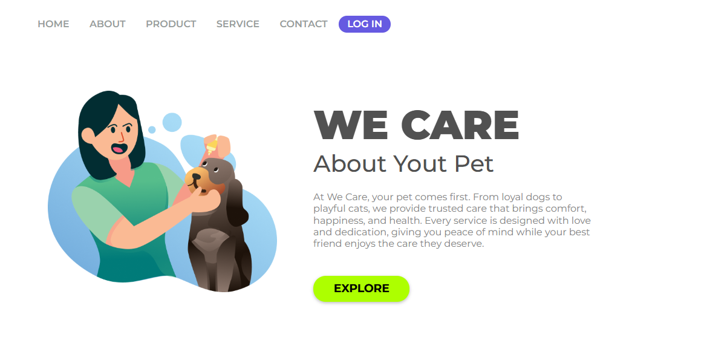
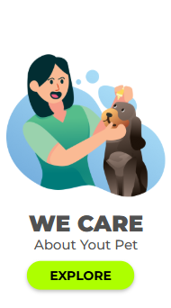

<h1>Projeto We Care Your Pet</h1>

  
  

 

Esse projeto veio de base de um design pronto.  
<strong>Créditos: 
<a href="https://rodolfomori.com.br">DevClub</a>

</strong>

<h3>Tecnologias usadas:</h3>

